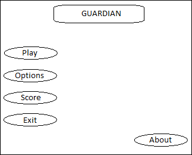
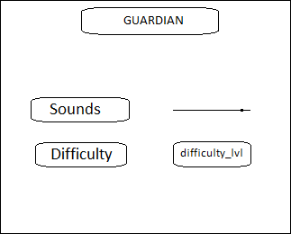
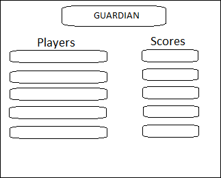

# Требования к проекту

# 1 Введение
Данное приложение будет представлять собой игру под названием “Страж”. Игрок сможет управлять персонажем по средствам клавиатуры и компьютерной мыши. В игре будет представлена возможность приобретения DLC. Игрок набравший необходимое количество монет, сможет его приобрести. Монеты можно будет получить по средствам убийства противников, сбора редких сундуков или приобретя монеты за реальные деньги.
# 2 Требования пользователя
## 2.1 Программные интерфейсы
Приложение предназначено для работы в средах операционных систем Windows. Для написания приложения используется язык программирования С#. Среда разработки – Unity.
## 2.2 Интерфейс пользователя
Интерфейс приложения будет разделен на:
1.  Главное меню игры, где пользователь сможет зайти в настройки, зайти в окно топа игроков, найти информацию о разработчике, начать игру или выйти из самой игры:

2.  Меню настроек, где пользователь сможет изменить сложность игры и громкость:

3.  Просмотр топа игроков:

## 2.3 Характеристики пользователей
### 2.3.1 Классы пользователей
Приложение не разделяет пользователей на группы, предоставляя каждому одинаковый функционал. Единственное различие между игроками будет в скорости получения дополнительного контента.
### 2.3.2 Аудитория приложения
Целевой аудиторией может выступать люди любой возрастной категории, обладающие минимальной компьютерной грамотностью.

# 3 Системные требования
## 3.1 Функциональные требования
### 3.1.1 Основные функции
Пользователь имеет возможность изменить уровень сложности, Приобрести игровую валюту при помощи которой можно будет приобрести уникальные скины.
### 3.1.2 Ограничения и исключения
1.	Проверка на доступность всех файлов необходимых для запуска игры.
2.	Проверка на подмену файлов связанных с доступом к DLC.
3.	Проверка на корректность заполнения информации об игроке перед добавлением в таблицу рекордов.
## 3.2 Нефункциональные требования
### 3.2.1 Атрибуты качества
1.	При недостатке файлов пользователю будет выводится список недостающих или измененных файлов, которые необходимо заменить.
2.	Все функциональные элементы пользовательского интерфейса имеют названия, описывающие действие, которое произойдет при выборе элемента.
3.	При сохранении или неожиданном выходе из приложения все данные должны быть записаны в файл. При повторном запуске пользователь сможет продолжить с того же места.
